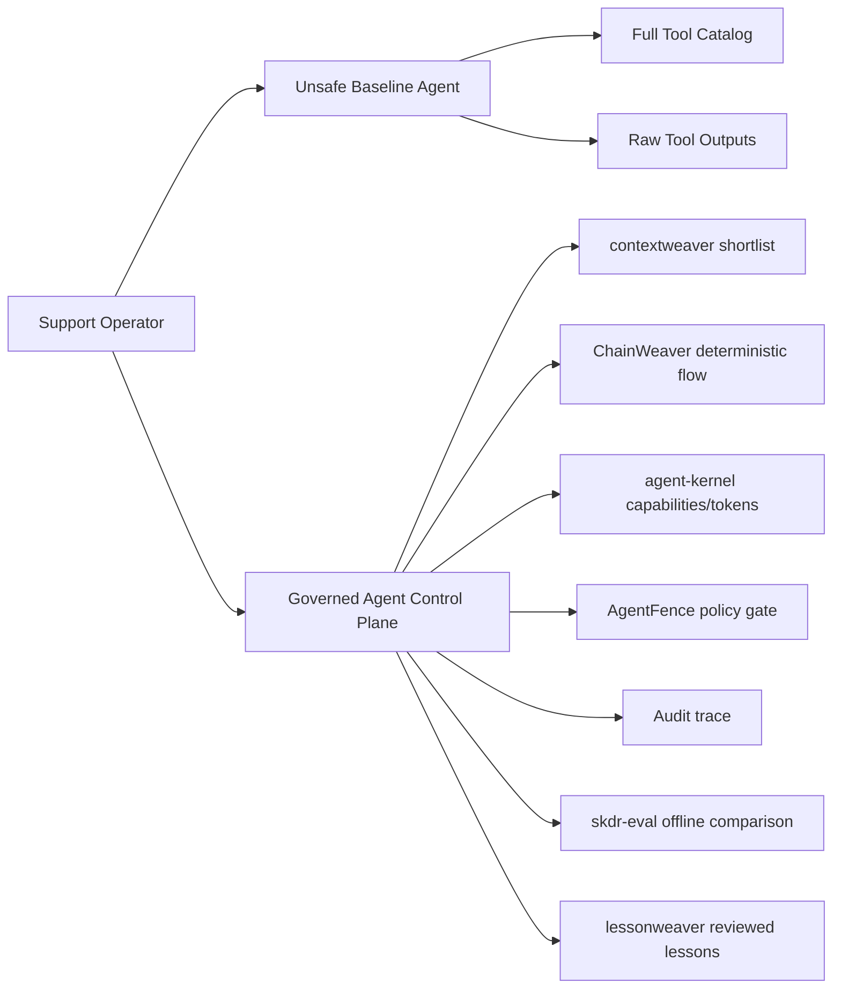

# enterprise-agent-control-plane

[](https://github.com/dgenio/enterprise-agent-control-plane/actions/workflows/tests.yml)
[](LICENSE)
[](pyproject.toml)
[](README.md#disclaimer)
[](https://pub.towardsai.net/the-weaver-stack-one-contract-layer-for-safe-llm-agents-7f733cad5eac)

Runnable reference architecture for governed enterprise tool-using agents: bounded context, policy gates, audit traces.

Build the same Customer Operations agent two ways — an unsafe baseline vs a bounded, policy-gated, auditable **control plane** — and run the contrast offline.

## Who this is for

Platform and engineering teams, security teams, AI/data leaders, and consultants evaluating **agent governance** patterns for **tool-using agents** and **MCP** tools — anyone who needs bounded context, policy enforcement, and auditability before letting agents touch internal tools.

## What you get

- **Bounded context** — a capability shortlist instead of the full tool catalog.
- **Deterministic flows** — known business paths compiled out of the model loop.
- **Policy gate** — allow/deny/ask decisions with capability tokens (least privilege).
- **Audit trace** — a structured, queryable record of every governed run.
- **Offline evaluation** — score routing/policy changes before enabling them.
- A runnable **before/after** demo that prints a side-by-side contrast.

## Quickstart

```bash
make setup
make demo
make test
```

Run `make` (or `make help`) to list every target with a one-line description.

### Troubleshooting

- **`ModuleNotFoundError: No module named 'enterprise_agent_control_plane'`** — run
  `make setup` first (editable install), and run commands from the repository root.
- **`No module named 'pydantic'`** — the editable install did not complete; re-run
  `make setup`. The only runtime dependencies are `pydantic` and `pyyaml`.
- **Import/`AttributeError` mentioning `datetime.UTC`** — you are on Python older than
  3.10; this project requires **Python >= 3.10** (tested on 3.10–3.12).
- **`ruff` / `mypy` / `coverage` not found** — install the dev tooling with
  `pip install -e .[dev]`, then run `make lint` / `make type` / `make coverage`.

## What this repo is / is not

**It is:**

- a runnable **reference architecture** for governed tool-using agents,
- a **before/after governance demo** (unsafe baseline vs governed control plane),
- a teaching, consulting, and portfolio artifact.

**It is not:**

- production security software or a hardened gateway,
- a hosted agent/MCP gateway or a drop-in library,
- a source of any security guarantee.

## When to use it / when not to

**Use it when** you are evaluating agent-governance patterns, running a workshop, building an internal reference, or explaining the value of bounded context, policy gates, and audit traces.

**Don't use it** to secure a live production agent as-is — the tools and data are synthetic, the model is a deterministic offline stand-in, and there are no security guarantees.

## Problem statement

Enterprise teams often start with broad tool access and unbounded prompts, then discover weak policy controls, poor auditability, and inconsistent execution. This repository demonstrates a practical "before vs after" architecture for a **Customer Operations Agent** with deterministic flows and governance controls.

## Architecture (reference)



Shareable, externally-embeddable versions of this diagram and a captured demo
snippet live under [`docs/assets/`](docs/assets/README.md).

## Demo walkthrough

`make demo` runs the unsafe baseline across a realistic Customer Operations workload,
annotates each risk, then contrasts it with the governed path.

1. **Unsafe baseline** — a multi-case workload (refund, escalation, email reply,
   an ambiguous "just fix it" request, and a not-found case), each annotated with the
   gap it surfaces:
   - over-permissioned context (the full 9-tool catalog offered every step),
   - raw tool-output leakage (sensitive-looking fields forwarded verbatim),
   - **cumulative context growth** (catalog re-sent + raw outputs retained each step),
   - **poor tool selection** (an over-eager router reaches the destructive refund for a
     mere lookup),
   - **indirect prompt injection** (a planted `[FAKE]` ticket directive steers a write),
   - **no execution contract** (a refund fires on a not-found invoice, with no amount
     bound and no idempotency guard; a read failure is silently absorbed and a
     non-destructive action still runs against placeholder data),
   - **per-step model round-trips** (a fixed path re-decided every step instead of being
     compiled into a flow),
   - **sensitive-data exfiltration** (an injected `[FAKE]` directive redirects an outbound
     email to an external address with no egress boundary),
   - **durable-log leakage** (raw payloads, including sensitive-looking fields, persisted
     verbatim into `traces/unsafe_run.json` with no redaction),
   - **no aggregate budget** (nothing caps the count of writes or total money moved across
     a session),
   - policy-blind writes, audit-light logging, and a **lost operator correction** that
     recurs because nothing captures it.
2. **Governed path**
   - shortlists relevant capabilities,
   - runs deterministic refund-review flow,
   - blocks/reroutes risky action via policy decision,
   - returns bounded output frame,
   - emits audit trace under `traces/`.
3. **Side-by-side contrast** — a generated scorecard putting both paths on the same
   dimensions (tools exposed, raw fields in context, ungated writes, policy decisions,
   audit trace).

For the full before/after mapping — each baseline risk paired with the governed control
that closes it, the dgenio library it maps to, and where it lives in the code — see the
[control traceability matrix](docs/control-traceability.md).

Run just the baseline with `make baseline`: it refreshes the audit-light
[`traces/unsafe_run.json`](traces/unsafe_run.json) artifact from a real run and reports the
session's aggregate side effects.

Illustrative, inert fixtures live under [`demos/`](demos/) (a risky AI-generated change
that the [VibeGuard gate](docs/vibeguard.md) catches). The baseline "before" is written up in
[`docs/lesson-capture-gap.md`](docs/lesson-capture-gap.md),
[`docs/baseline-model-fidelity.md`](docs/baseline-model-fidelity.md) (why the gaps are
architectural, not a strawman), and
[`docs/baseline-incident-postmortem.md`](docs/baseline-incident-postmortem.md) (the gaps
combined into one un-investigable incident).

## Sample demo output

Real, copy-pasted excerpts from `make demo` (numbers are computed from the runs, not
hand-written). The governed path runs the **same** five-case workload as the baseline,
holding or halting every risky write instead of executing it:

```text
[2f] Governed path over the full multi-case workload (per-case contrast)
  case 'refund': 'refund request' -> flow=refund_review, status=ok, gated=billing.issue_refund -> approval_required
  case 'escalation': 'escalate this ticket' -> flow=escalation, status=ok, gated=support.create_task -> approval_required
  case 'email_reply': 'send a direct email reply' -> flow=customer_reply, status=ok, gated=email.send_reply -> approval_required
  case 'ambiguous': 'just fix it for this customer' -> flow=(no matching flow), status=no_matching_flow
  case 'not_found': 'refund request' -> flow=refund_review, status=halted (fail-closed before any write)
```

The before/after is then collapsed into one generated scorecard, saved as a reusable
artifact ([`traces/comparison_scorecard.md`](traces/comparison_scorecard.md)):

```text
[3] Side-by-side contrast (same refund case, both paths)
  dimension                             |   baseline |   governed
  ------------------------------------- | ---------- | ----------
  tools exposed to the model            |          9 |          5
  approx model-visible context (chars)  |       1290 |        108
  raw sensitive fields in model context |         14 |          0
  ungated write/destructive actions     |          1 |          0
  policy decisions recorded             |          0 |          1
  structured audit trace                |       none |        yes
  gated action: billing.issue_refund -> approval_required
```

The demo also shows role-differentiated decisions across principals, just-in-time
case-scoped capability tokens (only the capabilities a case needs, scoped to its trace and
short-lived), and a reviewed-lesson loop where a human-reviewed correction changes a
*candidate* policy while unreviewed lessons stay inert.

## What this demonstrates

- bounded context routing over large tool catalogs,
- deterministic, schema-shaped business paths,
- capability and policy gates for risky actions,
- auditable execution traces,
- offline evaluation lane for safer changes.

## dgenio ecosystem fit

- `contextweaver`: shortlist adapter in `catalog.py`
- `ChainWeaver`: deterministic executor adapter in `flows.py`
- `agent-kernel`: capability-token pattern in `policies.py` + governed path
- `AgentFence`: local allow/deny/ask policy gate in `policies.py`
- `skdr-eval`: offline comparison stub in `evals.py` + `evals/`
- `lessonweaver`: reviewed lesson staging stub in `lessons.py`
- `VibeGuard`: official [`vibeguard-gate`](https://pypi.org/project/vibeguard-gate/) artifact-hygiene gate plus a domain gate ([`scripts/vibeguard_gate.py`](scripts/vibeguard_gate.py)) for repo-specific regressions, both run by [`.github/workflows/vibeguard.yml`](.github/workflows/vibeguard.yml) — see [the VibeGuard gate doc](docs/vibeguard.md)

## Implemented now vs planned

Implemented now:
- runnable local demo,
- fake in-memory enterprise tools,
- baseline vs governed behavior,
- deterministic flow registry and runner,
- policy + audit + tests + CI.

Planned:
- production-grade integrations for each dgenio library,
- richer policy language and approval orchestration,
- expanded replay/evaluation datasets.

## Documentation

Start at the [documentation index](docs/README.md). Highlights:

- [Glossary](docs/glossary.md) — canonical definitions, linked to the code.
- [FAQ](docs/faq.md) — common agent-governance questions answered directly.
- [Examples gallery](docs/examples.md) — runnable, copy-paste snippets for each governed capability.
- [Recommended adoption path](docs/adoption-path.md) — layer the controls one at a time.
- [Daily Driver / workshop guide](docs/workshop-guide.md) — run this in a workshop or stakeholder demo.
- [Comparison](docs/comparison.md) — how this relates to neighboring approaches.
- [Control traceability matrix](docs/control-traceability.md) — each baseline risk mapped to its governed control, library, and code.
- [Integration maturity matrix](docs/maturity-matrix.md) — which controls are local stand-ins vs real packages.
- [Claims & receipts](CLAIMS.md) — every contrast number backed by a command and an artifact.

How to contribute: [`CONTRIBUTING.md`](CONTRIBUTING.md) and our
[`CODE_OF_CONDUCT.md`](CODE_OF_CONDUCT.md). Security scope and reporting:
[`SECURITY.md`](SECURITY.md). Release history: [`CHANGELOG.md`](CHANGELOG.md).
Working in this repo as an AI coding agent? See [`AGENTS.md`](AGENTS.md).

## Disclaimer

This is a runnable **reference architecture and learning repository**, not production security software and not a production hardening guide.

## Ecosystem libraries

The Weaver Stack libraries this architecture maps to. The display name is the
canonical spelling used throughout the docs; the repository slug is lowercase.
How realised each integration is today (local reference implementation vs real
package) is the [integration maturity matrix](docs/maturity-matrix.md).

| Library | Repository | Notes |
|---|---|---|
| contextweaver | https://github.com/dgenio/contextweaver | Bounded context / shortlist |
| ChainWeaver | https://github.com/dgenio/chainweaver | Deterministic flow executor |
| agent-kernel | https://github.com/dgenio/agent-kernel | Capability tokens, Frames, audit (aka `weaver-kernel`) |
| AgentFence | https://github.com/dgenio/agentfence | allow/deny/ask policy gate |
| skdr-eval | https://github.com/dgenio/skdr-eval | Offline evaluation |
| lessonweaver | https://github.com/dgenio/lessonweaver | Reviewed-lesson capture |
| VibeGuard | https://github.com/dgenio/vibeguard | Pre-merge safety gate (`vibeguard-gate` on PyPI) |
| weaver-spec | https://github.com/dgenio/weaver-spec | Shared domain/type contracts |
