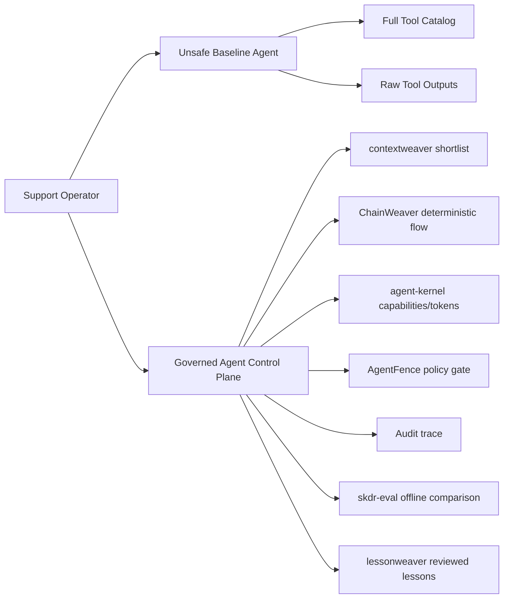

# enterprise-agent-control-plane

[](https://github.com/dgenio/enterprise-agent-control-plane/actions/workflows/tests.yml)
[](LICENSE)
[](pyproject.toml)
[](README.md#disclaimer)

Runnable reference architecture for governed enterprise tool-using agents, contrasting an unsafe baseline against a bounded, policy-gated, auditable control-plane path.

## Problem statement

Enterprise teams often start with broad tool access and unbounded prompts, then discover weak policy controls, poor auditability, and inconsistent execution. This repository demonstrates a practical "before vs after" architecture for a **Customer Operations Agent** with deterministic flows and governance controls.

## Architecture (reference)



## Quickstart

```bash
make setup
make demo
make test
```

## Demo walkthrough

`make demo` runs the unsafe baseline across a realistic Customer Operations workload,
annotates each risk, then contrasts it with the governed path.

1. **Unsafe baseline** — a multi-case workload (refund, escalation, email reply,
   an ambiguous "just fix it" request, and a not-found case), each annotated with the
   gap it surfaces:
   - over-permissioned context (the full 9-tool catalog offered every step),
   - raw tool-output leakage (sensitive-looking fields forwarded verbatim),
   - **cumulative context growth** (catalog re-sent + raw outputs retained each step),
   - **poor tool selection** (an over-eager router reaches the destructive refund for a
     mere lookup),
   - **indirect prompt injection** (a planted `[FAKE]` ticket directive steers a write),
   - **no execution contract** (a refund fires on a not-found invoice, with no amount
     bound and no idempotency guard),
   - policy-blind writes, audit-light logging, and a **lost operator correction** that
     recurs because nothing captures it.
2. **Governed path**
   - shortlists relevant capabilities,
   - runs deterministic refund-review flow,
   - blocks/reroutes risky action via policy decision,
   - returns bounded output frame,
   - emits audit trace under `traces/`.
3. **Side-by-side contrast** — a generated scorecard putting both paths on the same
   dimensions (tools exposed, raw fields in context, ungated writes, policy decisions,
   audit trace).

Illustrative, inert fixtures live under [`demos/`](demos/) (a risky AI-generated change
no pre-merge gate would catch). The lesson-capture gap is written up in
[`docs/lesson-capture-gap.md`](docs/lesson-capture-gap.md).

## What this demonstrates

- bounded context routing over large tool catalogs,
- deterministic, schema-shaped business paths,
- capability and policy gates for risky actions,
- auditable execution traces,
- offline evaluation lane for safer changes.

## dgenio ecosystem fit

- `contextweaver`: shortlist adapter in `catalog.py`
- `ChainWeaver`: deterministic executor adapter in `flows.py`
- `agent-kernel`: capability-token pattern in `policies.py` + governed path
- `AgentFence`: local allow/deny/ask policy gate in `policies.py`
- `skdr-eval`: offline comparison stub in `evals.py` + `evals/`
- `lessonweaver`: reviewed lesson staging stub in `lessons.py`
- `VibeGuard`: CI workflow placeholder in `.github/workflows/vibeguard.yml`

## Implemented now vs planned

Implemented now:
- runnable local demo,
- fake in-memory enterprise tools,
- baseline vs governed behavior,
- deterministic flow registry and runner,
- policy + audit + tests + CI.

Planned:
- production-grade integrations for each dgenio library,
- richer policy language and approval orchestration,
- expanded replay/evaluation datasets.

## Disclaimer

This is a runnable **reference architecture and learning repository**, not production security software and not a production hardening guide.

## Library links (placeholders)

- contextweaver: https://github.com/dgenio/contextweaver
- ChainWeaver: https://github.com/dgenio/chainweaver
- agent-kernel: https://github.com/dgenio/agent-kernel
- AgentFence: https://github.com/dgenio/agentfence
- skdr-eval: https://github.com/dgenio/skdr-eval
- lessonweaver: https://github.com/dgenio/lessonweaver
- VibeGuard: https://github.com/dgenio/vibeguard
