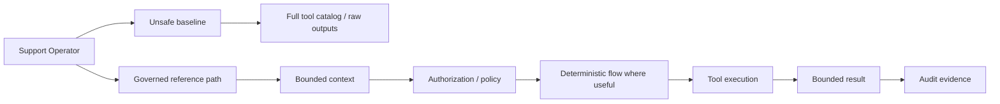

# enterprise-agent-control-plane

[](https://github.com/dgenio/enterprise-agent-control-plane/actions/workflows/tests.yml)
[](LICENSE)
[](pyproject.toml)
[](#disclaimer)

Runnable reference architecture for governed enterprise tool-using agents: bounded context, deterministic business paths, policy/authorization gates, and auditable execution.

> **Portfolio role: ASSEMBLE IT.** This repository should come *after* individual controls have proved useful elsewhere. Its job is to show that useful components compose cleanly on the same realistic synthetic workflow—not to convince you that every dgenio library is valuable. See [the portfolio-role note](docs/assemble-it.md).

## What to evaluate here

The canonical experiment is the same **Customer Operations** scenario implemented two ways:

- **plain** — a competent in-house implementation with no dgenio runtime dependencies;
- **with ecosystem** — the same domain, tools, fixtures, and expected invariants, delegating only the relevant responsibilities to actual OSS components.

The plain implementation must not be a strawman. The meaningful question is not “can we delete the most lines of code?” but:

> Do both implementations preserve the same safety/business invariants, and which governance responsibilities do we want to maintain ourselves versus delegate to reusable components?

The restructuring and real-integration work is tracked in [#80](https://github.com/dgenio/enterprise-agent-control-plane/issues/80).

## Current status

**Today this repo is a runnable offline reference implementation.** Its governed path contains local implementations/stand-ins for several Weaver concepts. Those names explain the intended architecture; they do **not** prove the sibling packages executed.

Real ecosystem mode is intentionally being narrowed to the smallest useful surface:

- `contextweaver` — bounded context / capability shortlist;
- `chainweaver` — deterministic known-path execution;
- `weaver-kernel` / agent-kernel — scoped authorization;
- AgentFence — real Go/sidecar policy boundary over tool calls;
- `weaver-spec` only where a shared contract is genuinely needed.

`skdr-eval`, `lessonweaver`, and VibeGuard are not mandatory parts of the initial comparison merely to make the architecture look complete. Routing evaluation belongs primarily in `agent-routing-eval-lab`; other components should enter this repo only when a real composition need justifies them.

A future real-mode receipt must record component version/commit provenance. If a native integration is unavailable, it must be reported as unavailable—never silently replaced by local code while still being labelled “real.”

## Quickstart: current offline reference

```bash
make setup
make demo
make test
```

Run `make` or `make help` for the available targets.

The current demo contrasts an intentionally unsafe baseline with the existing governed/reference path. It is useful for studying the architecture while #80 builds the fair `plain` vs `with_ecosystem` comparison.

## Behavioral invariants are the primary evidence

The eventual side-by-side comparison should run identical fixtures through both competent implementations and answer questions such as:

- Can an unauthorized principal perform a money-moving write?
- Can untrusted tool output steer a forbidden action?
- Can sensitive raw values reach model-visible context?
- Does every risky write pass authorization/policy and leave reviewable evidence?
- Do legitimate authorized actions still succeed?
- Does a known business process execute deterministically and fail closed when prerequisites fail?
- What breaks when a tool schema or policy changes?
- Which controls are local maintenance responsibilities and which are delegated to a real component?

Lines of governance code, install size, dependency count, or similar statistics may be supplementary facts. They are too easy for a repo controlling both implementations to game, so they are not headline proof.

## Current reference architecture



This diagram intentionally describes **responsibilities**, not a claim that every sibling library is currently wired in.

## What the current demo shows

`make demo` uses synthetic Customer Operations cases to expose failure modes such as:

- broad tool exposure and ambient authority;
- raw/sensitive tool output entering context;
- repeated model decisions on known paths;
- unapproved writes and money-moving actions;
- indirect instructions in tool output;
- missing execution contracts / fail-open behavior;
- weak audit evidence.

The governed/reference path demonstrates corresponding architectural ideas: shortlist/bounded context, deterministic flow selection, authorization/policy decisions, bounded outputs, and audit traces.

See the [control traceability matrix](docs/control-traceability.md), [baseline-model fidelity note](docs/baseline-model-fidelity.md), and [incident postmortem](docs/baseline-incident-postmortem.md) for the existing teaching evidence.

## What this repo is / is not

**It is:**

- a runnable **reference architecture**;
- a place to test fair composition and integration contracts;
- an offline teaching example for enterprise agent-governance responsibilities.

**It is not:**

- the recommended first touchpoint for the portfolio;
- proof that each Weaver component is useful on its own;
- production security software or a hardened MCP gateway;
- a hosted product;
- a compliance/certification artifact;
- a reason to integrate every sibling library into one process.

## Portfolio sequence

The labs have deliberately different jobs:

1. [`mcp-agent-security-dojo`](https://github.com/dgenio/mcp-agent-security-dojo) — **BREAK IT**: reproduce agent-security failures and compare mitigations.
2. [`agent-routing-eval-lab`](https://github.com/dgenio/agent-routing-eval-lab) — **MEASURE IT**: evaluate routing changes from logged evidence.
3. this repo — **ASSEMBLE IT**: compose controls that have already earned their place.

If the upstream components do not develop meaningful external pull, leaving this architecture smaller and partially deferred is preferable to building a self-referential integration platform.

## Scope discipline

Until the plain-vs-real-ecosystem comparison has external pull, these are deliberately not priorities:

- new domains or scenario galleries;
- multi-agent or multi-tenant product surfaces;
- real-model/provider integrations;
- hosted control-plane services;
- workshop/content/discoverability programs;
- GitHub Pages or packaging this reference architecture as a product;
- standards mappings as a substitute for evidence;
- framework adapters or a new policy-language product;
- integrations whose main value belongs in another lab.

Reliability work on the **existing** reference remains valuable: fail-closed behavior, redaction completeness, policy/audit correctness, schema parity, deterministic fixtures, and property tests all make the eventual comparison more trustworthy.

## Documentation

Start at [docs/README.md](docs/README.md). Key references:

- [ASSEMBLE IT role](docs/assemble-it.md) — sequencing, fairness rules, and scope guardrails.
- [Control traceability](docs/control-traceability.md) — baseline risks mapped to controls/code.
- [Integration maturity matrix](docs/maturity-matrix.md) — local reference vs actual integration status.
- [Claims & receipts](CLAIMS.md) — reproducibility for current demo claims.
- [Governance model](docs/governance-model.md) and [adoption path](docs/adoption-path.md).
- [SECURITY.md](SECURITY.md) and [CONTRIBUTING.md](CONTRIBUTING.md).

## Disclaimer

This is a runnable **reference architecture and learning repository**, not production security software, a production hardening guide, or evidence of compliance. All tools/data are synthetic and the default model behavior is deterministic/offline.
